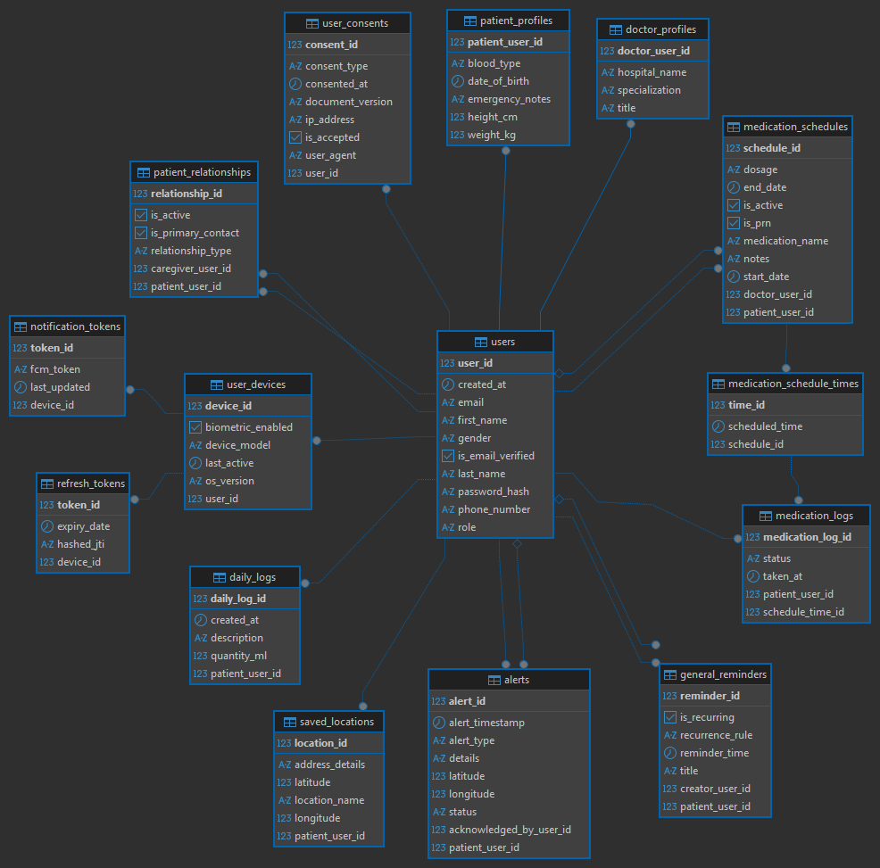

# Memento: AI-Assisted Elderly Care System

> **Info:** I'm developing this project for my **Bachelor's Thesis**, together with a mobile developer.

Memento is a mobile app designed to enhance the daily lives of elderly individuals. Our primary objective is to minimize the workload on elderly users to help them overcome technological barriers, while providing a secure platform for their relatives to easily monitor their daily routines.

---

## Quick Start

Only Docker Engine is needed to run the project, Spring Boot will automatically spin up PostgreSQL (populated with mock data) and Redis containers via the included compose.yaml file.

1. **Start the Application:** Make sure Docker Engine is running in the background, then run `MementoApplication.java`.

2. **Explore the API:** Once the application is running, you can visit the Swagger UI at:
   `http://localhost:8080/swagger-ui/index.html`

> **Note:** Features like email notifications and DailyLog text formatting require additional configurations in the `application.properties` file such as SMTP settings and `GROQ_API_KEY`.

### Test Credentials

You can use these test entities to receive Access JWTs for Swagger instead of configuring SMTP settings for registration:

| Role | Email | Password
| :--- | :--- | :---
| **Patient** | `demo.patient@test.com` | `1234567Ab+`
| **Doctor** | `demo.doctor@test.com` | `1234567Ab+`
| **Relative** | `demo.son@test.com` | `1234567Ab+`

---

## Tech Stack

**Java 17** | **Spring Boot 3** | **PostgreSQL** | **Redis**  | **Groq AI** | **Docker**

---

## Key Features

* **Security:** Session management utilizing rotated Refresh (14 days) and Access (15 minutes) JWTs. Rate limiting is enforced via Bucket4j to prevent API abuse.

* **Caching:** Utilizes Redis for storing OTPs, email verification links, and managing the JWT Blacklist. It also caches FCM (Firebase Cloud Messaging) tokens alongside the database to ensure rapid and efficient execution of the notification cron jobs.

* **Relative Monitoring:** Allows users to link their family members or caregivers to their accounts via the app. These relatives can securely track the elderly user's daily schedules, including medication adherence and nutritional intake.

* **AI Integration:** Integrated with Groq API to process natural language voice inputs into structured daily nutritional logs, and to power an in-app guide assistant.

* **Medication & Health Tracking:** Automated cron jobs for medication reminders, tracking intake compliance, and logging daily hydration/nutrition.

* **Emergency Alert System:** Processes critical events (such as detected falls) from the mobile client and automatically dispatches push notifications to designated emergency contacts.

---

### Database Schema (ERD)

